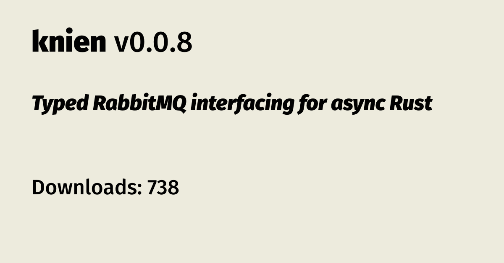

# OG-LOC

Open Graph image generator for crates.io

## Building

1. Install Rust following the instructions on <https://rustup.rs>.
2. Install the Fira Sans font on your machine: <https://fonts.google.com/specimen/Fira+Sans> (a later version might include the fonts in the binray itself)
3. Run `cargo build` for a debug build, or `cargo build --release` for an optimized build

## Running

OG-LOC can either performa a one-shot image generation or run as a HTTP server.

```bash
$ cargo run -q -- --help
Usage: og-loc <COMMAND>

Commands:
  serve     Run the server
  one-shot  Do a single conversion
  help      Print this message or the help of the given subcommand(s)

Options:
  -h, --help  Print help
```

### One shot
To run generate a single Open Graph image for a crate, use the `one-shot` subcommand:

```
$cargo run -q -- one-shot --help
Do a single conversion

Usage: og-loc one-shot --name <NAME> --version <VERSION> --out <OUT_PATH>

Options:
  -n, --name <NAME>        The name of the crate [env: NAME=]
  -v, --version <VERSION>  The version of the crate [env: VERSION=]
  -o, --out <OUT_PATH>     The path to the PNG output file [env: OUT_PATH=]
  -h, --help               Print help
```

For instance, to get an image for the `knien` crate at version `0.0.8`, run

```bash
cargo run -- one-shot --name knien --version 0.0.8 --out knien-og.png
```

Result:


### Server
To run the OG-LOC server, use the `serve` subcommand:

```bash
$ cargo run -q -- serve --help
Run the server

Usage: og-loc serve --addr <ADDR>

Options:
  -a, --addr <ADDR>  The socket address to listen on [env: ADDR=]
  -h, --help         Print help
```

For instance, to serve locally from port 8000, run

```bash
cargo run -- serve --addr 0.0.0.0:8000
```

If you enable the `--release` flag, image generation will be much faster.

Open your browser, and navigate to `http://localhost:8000/og/<CRATE_NAME>/<CRATE_VERSION>`
For instance, to get an image for the `knien` crate at version `0.0.8`, navigate to <http://localhost:8000/og/knien/0.0.8>

## Internals
OG-LOC uses the awesome [Typst](https://typst.app/) typesetting system internally to render the PNG images from a [Jinja2 template](./template.typ.j2) that gets filled with information from crates.io.
The HTTP server is implented using Axum, and information from crates.io is fetched using Reqwest.

